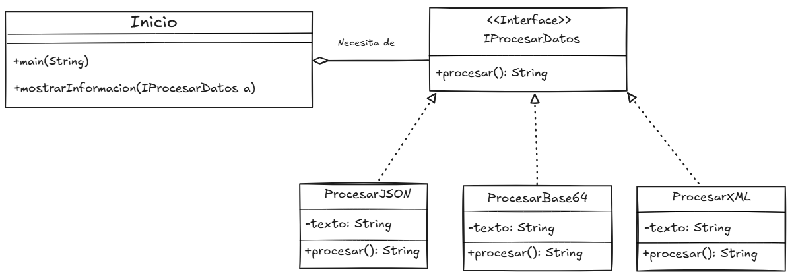

# Object-Oriented Programming in Java: Solving Practical Requirements

This repository showcases the application of Object-Oriented Programming (OOP) principles in Java to address a set of specific requirements. Explore how concepts like encapsulation, inheritance, and polymorphism are utilized to create robust and well-structured solutions.

--- 

# Problem Statements:

## 1. Design and code a solution for the following problems:

a. **Requirement:** An application is required that allows managing grades for students. Courses can have quantitative grades (0 to 5) or qualitative grades (Approved, Reproved, Pending). For each course, students must be added and their respective grade registered. The following reports are required: List of courses, list of students, list of grades per course. For this exercise, data will be entered by the user.

b. **Requirement:** A library loan system is required for an educational institution. Users must be created based on their corresponding role, which will allow them to borrow books. Late fees must be applied to users who return books after the assigned due date. Late fees depend on the user's role: teacher (5000 per day), student (1000 per day), and employee (2500 per day). The following reports are required: list of books, borrowed books, users, and assigned fines. For this exercise, there will be no data entry by the user; the application should have predefined data.

> [!NOTE]
> For the previous points, generate the methods that allow for the persistence of information in flat files and its subsequent display on the screen.

> [!TIP]
> Generate the respective .jar files for points 1.a and 1.b respectively, then execute them through the console. Attach evidence.

## 2. Code an application that allows the implementation of the given class diagram:

For the JSON, Base64, and XML aspects, you can use external components that support the solution.